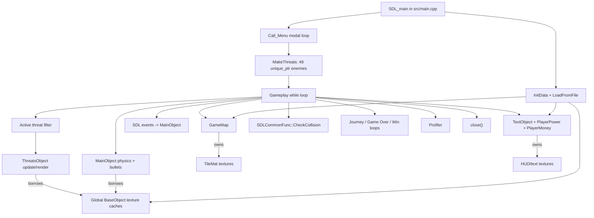
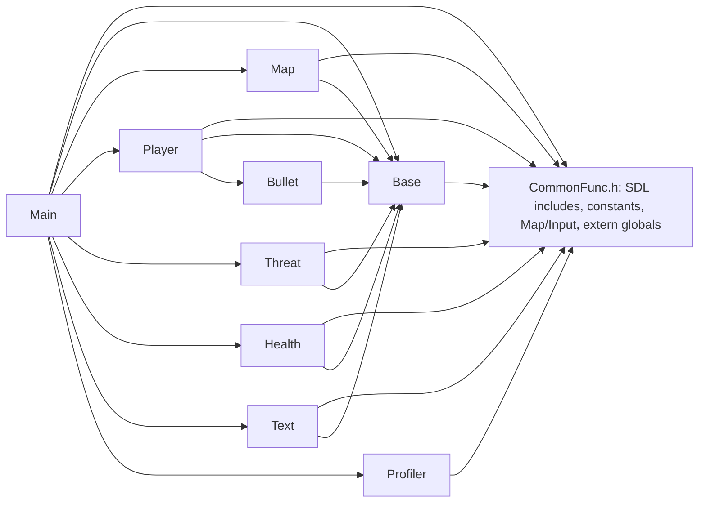

# Architecture

## Architectural style

The code is a mixed procedural and object-oriented game architecture. It has focused classes for several game concepts, but no encapsulating `Game` or `Application` object. `src/main.cpp` is the composition root, resource owner, screen controller, update scheduler, collision coordinator, HUD controller, and shutdown manager. State is shared through file globals and `extern` variables in `CommonFunc.h`.

Calling this a full scene/state architecture would be misleading. `GameState` is assigned but never read to dispatch behavior. Menu, game-over, win, and journey behavior are separate blocking/modal loops invoked from procedural control flow.

## Major systems and relationships

## Responsibility and ownership boundaries

| Boundary | Actual behavior |
| --- | --- |
| SDL subsystem ownership | `main.cpp::InitData` initializes; `main.cpp::close` shuts down |
| Top-level resources | Mostly raw global pointers/objects in `main.cpp` and `CommonFunc.cpp` |
| General image texture | `BaseObject` owns by default; `UseTexture` switches to a borrowed reference |
| Cached character/enemy/bullet textures | Global `BaseObject` instances own; player, enemies, bullets borrow |
| Enemy objects | `ThreatList` owns through `std::unique_ptr` |
| Bullet objects | `MainObject` owns raw pointers by convention and manually deletes them |
| Map data | `GameMap` owns runtime/base copies; the loop holds a stable reference to the runtime map |
| Tile textures | `GameMap::tile_mat` owns via `BaseObject` inheritance |
| UI text | Each `TextObject` owns its current text texture but borrows a `TTF_Font*` |

The distinction between owned and borrowed `BaseObject::p_object_` is encoded by `owns_texture_`. Copy construction and assignment are disabled, preventing accidental duplicate owners.

## Dependency direction

`CommonFunc.h` also includes `TextObject.h`, while `TextObject.h` includes `CommonFunc.h`, creating an unnecessary circular header dependency. Several class headers rely on broken include guards, making include order fragile.

## Strengths

- Player, enemy, map, text, bullet, HUD, and profiler behavior are at least separated into recognizable modules.
- Enemy ownership uses `unique_ptr` and restart clears deterministically.
- Runtime character/enemy/bullet textures are preloaded and borrowed rather than reloaded per frame.
- HUD text caches by text/font/color.
- Map draw and threat processing use viewport/active-range filtering.
- Base map state is cached for restart rather than reread from disk.
- The profiler provides low-cost operational visibility.

## Weaknesses and scalability limits

- The 1219-line `main.cpp` and broad global state make ordering and lifetime implicit.
- Screen modes are nested loops, not composable states; this blocks a clean Emscripten callback and complicates event/timing behavior.
- Physics, camera, respawn, and animation advance per frame even though a delta time is calculated.
- Collision uses a tested AABB helper with explicit player/bullet and threat hitboxes. The 115x95 and 150x100 footprints preserve the original game's difficulty while containment and edge-crossing overlaps are detected.
- Map dimensions, win thresholds, journey boundaries, spawn regions, controls, and asset paths are compile-time/hard-coded.
- Resource load failure is not propagated, and ownership is only partly RAII.
- A malformed map tile ID can index beyond `tile_mat`.

For this project size, the right target is a small `Game` owner plus a simple state enum/switch and explicit RAII handles—not an ECS, dependency-injection framework, or engine rewrite.
