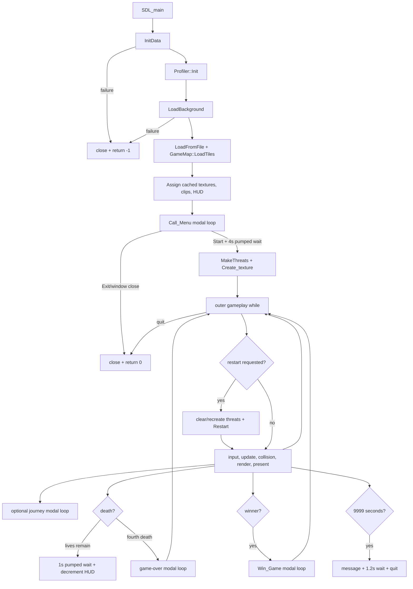

# Runtime Flow

## Lifecycle overview

## 1. Initialization

`src/main.cpp::main` seeds `rand`, then calls `InitData`:

1. `SDL_Init(SDL_INIT_VIDEO)`.
2. Linear-rendering hint.
3. 1422x800 shown window.
4. Accelerated renderer without `SDL_RENDERER_PRESENTVSYNC`.
5. `IMG_Init(IMG_INIT_PNG)`.
6. `TTF_Init()`.
7. A second `SDL_Init(SDL_INIT_VIDEO | SDL_INIT_AUDIO)`.
8. `Mix_OpenAudio(44100, MIX_DEFAULT_FORMAT, 2, 2048)`.

Only failure of `InitData` or background loading reaches an immediate error return. `LoadFromFile` returns `void` and does not validate fonts, surfaces, textures, map data, or audio chunks as a group.

`LoadFromFile` loads four font handles, menu/win/journey surfaces, the map, Monster image, cached character/bullet/enemy/HUD textures, and seven WAV chunks. `Create_texture` converts all screen surfaces to textures and releases the surfaces before the menu starts. `GameMap::LoadTiles` adds eight tile textures. Player, enemy, bullet, and HUD objects borrow the cached textures.

## 2. Menu and game creation

`Call_Menu` reuses the preloaded menu texture plus white/red cached label variants. Its loop renders continuously and polls mouse/quit events. Clicking Start plays the start sound, runs a four-second event-pumping wait, starts looping map music, frees menu resources, and returns. Clicking Exit or closing the window frees menu resources and sets quit flags.

After Start, `MakeThreats` creates 48 enemies as four groups of 12 `unique_ptr` objects. Profiling begins and control enters the gameplay loop. Game-over/win/time-limit labels reuse `TextObject` caches; only dynamic values rebuild when their content changes.

## 3. One gameplay frame

The frame order in `src/main.cpp:206-470` is:

1. Record frame start, calculate/clamp `delta_time`, begin profiler timing.
2. If replay was requested, recreate all threats and reset map/player/HUD state.
3. Drain SDL events; window close sets quit, every event is also passed to player input.
4. Clear renderer.
5. Advance and draw the repeating background.
6. Potentially enter a journey modal loop.
7. Copy the map from `GameMap`, advance camera by six pixels, publish global `map_start`.
8. Update/render bullets, then update/render player.
9. Copy modified map back and render visible tiles.
10. Render health and heart icons.
11. Build active enemy list; update/render active enemies; test player/enemy collision.
12. Render the Monster overlay.
13. Handle death/game-over.
14. Handle win/win-replay.
15. Test each bullet against the active collision targets and erase hits.
16. Update/render elapsed time, score, and high score.
17. Present, end profiler timing, and delay to the nominal frame budget.

Simulation and render are interleaved. Player/enemy/bullet visuals are submitted before related collision resolution, so an entity hit in the current frame may already have been drawn for that frame.

## 4. State transitions

| Transition | Trigger | Actual control flow |
| --- | --- | --- |
| Menu -> Playing | Start click | Four-second pumped wait, return from `Call_Menu` |
| Playing -> Journey | Exact camera equality | Nested loop until Space/Escape |
| Playing -> Respawn | Player/enemy collision or fall and deaths <= 3 | One-second pumped wait, decrement health, continue outer loop |
| Playing -> Game Over | Fourth death | Nested loop until Space/Escape/window close |
| Game Over -> Playing | Space | Four-second pumped wait; reset at next outer-loop start |
| Playing -> Win | `winner == true` | Nested `Win_Game` loop |
| Win -> Playing | Space | Four-second pumped wait; immediate reset after `Win_Game` |
| Any pumped wait/modal -> Quit | Some Escape/window-close paths | Set global flags and unwind |

`GameState` assignments annotate these transitions but do not control them. There is no `switch (game_state)` dispatcher.

The journey condition uses equality against `280 + n * 16170`, while normal camera movement adds six from zero. Every target is 4 modulo 6 and is therefore unreachable during uninterrupted normal scrolling. A restart can set the camera directly to 16450 or 32620, making some journey screens reachable as a side effect. This is a confirmed progression defect, not a hypothetical risk.

## 5. Restart and shutdown

`Restart` restores `GameMap` from its cached base map, selects one of three camera/player checkpoints from global `map_start`, resets collected hearts and the health HUD, and sets a three-frame player comeback counter. Threats are recreated separately.

`close` is guarded against repeat calls. It stops playback, clears threats/bullets and texture borrowers, frees cached/tile/UI textures, closes fonts/chunks/the audio device, destroys renderer/window, and then quits mixer/image/TTF/SDL.
