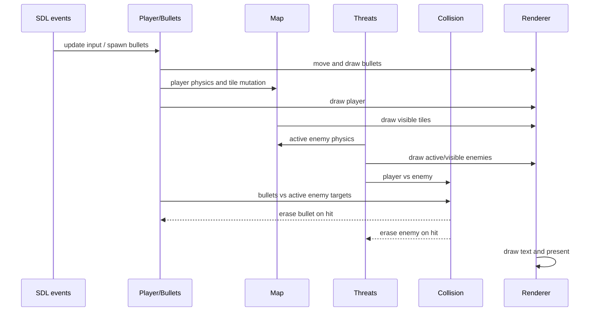

# Game Loop Analysis

## Loop model

The gameplay loop is a single-threaded, delta-scaled loop with a 60 Hz behavior baseline. `UpdateDeltaTime` measures elapsed seconds, clamps catch-up to 0.05 seconds, and converts it to `frame_scale = delta * 60`. Player/enemy physics, bullets, camera, background, animation, and short respawn counters consume that scale.

Gameplay constants retain their original meaning at `frame_scale == 1`:

| Behavior | Current rate source |
| --- | --- |
| Player horizontal | `PLAYER_SPEED` = 8 pixels/frame |
| Player gravity | `GRAVITY_SPEED` = 0.8 velocity/frame |
| Player jump | `PLAYER_JUMP_VAL` = 20 velocity units |
| Enemy horizontal | `THREAT_SPEED` = 8 pixels/frame |
| Enemy gravity | `THREAT_GRAVITY_SPEED` = 1 velocity/frame |
| Bullet horizontal | 20 pixels/frame |
| Camera/map | `MAP_RUN` = 6 pixels/frame |
| Background | 2 pixels/frame |
| Player animation | one frame per two `Show` calls while moving |
| Enemy animation | one frame per `Show` call |
| Respawn delay | `come_back_time_` counts outer frames, normally three |

Sub-pixel remainders preserve fractional bullet/camera/background motion. Gravity uses an associative discrete-step extension, so two half steps match one original 60 Hz step in focused tests. This preserves the original 60 Hz feel while avoiding proportional slow motion on slower frames.

## Timing and frame cap

`CapFrameRate` uses the fractional `1000.0 / 60` target. A retained millisecond remainder alternates integer delays instead of truncating every frame to 16 ms. Slow frames skip the delay, while delta scaling keeps simulation rates tied to elapsed time.

`Profiler::EndFrame` is called before `CapFrameRate`, so its `frame_ms_*` values measure update/render CPU wall time but exclude the cap delay. Its `fps_avg` uses elapsed interval time and therefore includes delay. These values answer different questions and should not be compared as identical frame durations.

Long flows use `WaitWithEventPump`, which polls quit/Escape and sleeps 1 ms repeatedly. Menu, journey, game-over, and win remain independent modal loops, but Step 6 applies the same 60 Hz frame budget to each so static states no longer busy-render.

## Input timing

The outer loop drains all queued events before simulation. `MainObject::HandelInputAction` updates held-direction flags from key down/up, latches jump until `DoPlayer`, and allocates a bullet on mouse down. It receives every event, including unrelated events.

Risks:

- `MainObject::status_` begins at `-1`. Firing before the first `A`/`D` press does not select either bullet direction branch.
- `BulletObject::bullet_dir_` is not initialized by its constructor. The resulting projectile reaches `HandleMove` with an indeterminate direction and may remain active indefinitely. Reading that indeterminate value is undefined behavior.
- Normal gameplay does not handle Escape directly; Escape is handled in selected modal/wait paths.
- Input is processed by different code in each modal screen, producing inconsistent controls.

## Update and collision ordering

Important consequences:

- The map is drawn after the player, so nonblank tiles can occlude the player.
- Bullets and enemies are drawn before bullet/enemy collision erases them.
- Player/enemy collision uses enemy rectangles gathered during the same update.
- A player collision erases an enemy before it is appended to the active collision list and breaks the threat loop, so later active enemies are not processed that frame.
- Bullet collision checks only the active targets collected before that break.

## Collision semantics

`SDLCommonFunc::CheckCollision` uses the supplied `SDL_Rect::w/h` in a symmetric AABB query. Containment and overlap from every direction count as collisions; rectangles that only touch at an edge do not. Call sites build explicit 115x95 player/bullet and 150x100 threat hitboxes, retaining the collision footprint and difficulty of the original game rather than depending on sprite-sheet dimensions.

## Animation and state timing

Player and enemy animation advance on render calls, not elapsed simulation time. Off-range enemies are skipped entirely, which intentionally sleeps their animation and physics. An enemy becomes active within one screen-width margin of the viewport.

Elapsed game time uses `SDL_GetTicks()/1000`, not `delta_time`. On the first game it includes time spent before gameplay, including menu dwell/start wait, because `start_time` is zero-initialized and not set on Start. Death replay does not reset `start_time`. Win sets `start_time` immediately before entering the win modal, so time spent on the win screen is included after replay. These are confirmed timing semantics and are likely not intended.

## Per-frame work

Confirmed recurring work includes two full `Map` copies, allocation/free of a local active-target vector, tile culling/draw, active enemy update/draw/collision, bullet update/draw/collision, and text cache checks. HUD text only regenerates when its content changes. The timer string changes once per second; heart/high-score textures change only with score changes.

Menu/game-over/win/journey loops are paced to 60 Hz. Static modal text is cached, and gameplay updates/renders/collides only enemies inside the camera active margin; render functions additionally apply viewport checks.
