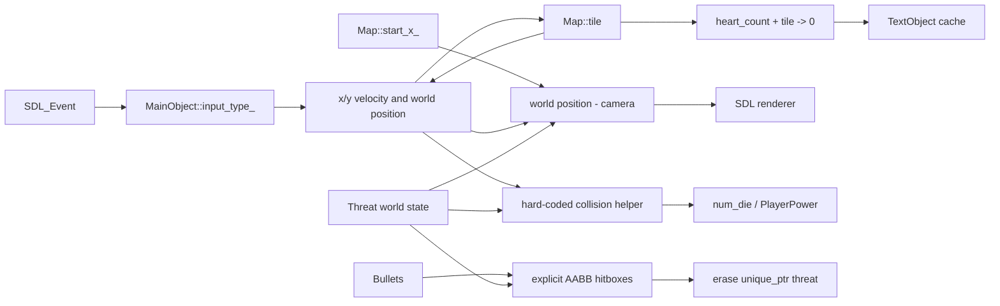

# Data and State Flow

## Core state domains



## Input to player and bullets

`SDL_PollEvent` drains into global `g_event`. The whole event is passed by value to `MainObject::HandelInputAction`:

- `A`/`D` key events mutate `Input::left_`/`right_` and facing `status_`.
- `W` key down sets a jump request consumed on the next `DoPlayer` call.
- Left mouse down plays fire audio, acquires a recycled bullet when available, borrows the global bullet texture, resets motion state, and places it using the player's current screen `rect_`.
- Death/restart enters `PrepareRespawn`, which clears latched movement and jump state so key events consumed by modal waits cannot move the revived player.

Bullet positions are screen-space, not world-space. They move against `SCREEN_WIDTH`, so camera movement does not affect an existing bullet.

## Map/camera exchange

`GameMap` is the sole owner of the mutable runtime map. The gameplay loop obtains one stable reference after startup:

```text
GameMap::GetMap() by reference
    -> MapRun mutates camera by 6 * frame_scale with a fractional remainder
    -> MainObject mutates collected tile cells through the same reference
    -> GameMap::DrawMap reads the same runtime map
```

The player and enemies hold their own world coordinates. Before rendering, each receives `map_data.start_x_/start_y_` and computes `rect_ = world - map offset`. The camera advances independently of player input.

## Player/map collision and score

`MainObject::CheckToMap` samples up to two tiles for horizontal motion and two for vertical motion. Tile ID 0 is blank; ID 1 is a heart; every other positive ID is solid for player/enemy collision. On heart contact, sampled tile cells are set to zero and the player's internal count increments. Horizontal collection plays a sound; vertical collection does not.

The global `heart_count` is refreshed from the player before the player's current-frame map check, so the text/HUD score can lag a newly collected heart by one frame. `high_score` is then updated from that global count and is never persisted.

## Threat flow

`MakeThreats` creates four spatial groups. Global cached textures outlive the list, and each enemy stores borrowed references. Every frame:

1. `IsThreatActive` compares enemy world X/frame width with camera range plus a screen-width margin.
2. Active enemies receive camera offset.
3. Patrol code selects direction/borrowed texture.
4. Enemy physics reads the current runtime map reference.
5. Render computes screen rectangle and culls against the viewport.
6. A collision target of non-owning pointer plus explicit threat hitbox is appended only when the player did not consume that enemy.

Inactive enemies do not update, animate, or render.

## Collision and lifetime flow

Enemy ownership stays in `ThreatList` (`vector<unique_ptr<ThreatsObject>>`). The per-frame `active_threats` vector stores non-owning raw pointers and precomputed hitboxes. Player collision erases by index before adding the target and breaks. Bullet collision later searches the owning list by raw pointer value before erasing.

Bullets are owned by `MainObject` through `unique_ptr`. `main.cpp` receives a const reference to that vector. Inactive, hit, and restart bullets move to a reuse pool; shutdown clears both active and pooled ownership. The main loop avoids incrementing its bullet index after recycling the current element.

## Screen/progression state

State is distributed among:

- `is_quit`, `start_Game`, `isRestarting`, `win_and_restart` in `main.cpp`.
- `winner`, `change_threats`, `map_start`, and `minus` in `CommonFunc.cpp`.
- `game_state`, which is written but not used for dispatch.
- Local modal-loop flags in menu/game-over/win/journey functions.

This means no single variable defines the complete screen state. Any state refactor must first preserve the exact transitions documented in `05-runtime-flow.md`.

## Audio/data side effects

Audio chunks are loaded globally and passed selectively: fire/heart/death/win functions call `Mix_PlayChannel` directly. Map music loops after Start. There is no audio service, channel policy, volume configuration, or null-handle guard.

## Save/load flow

No save file, serialization, settings file, or persistent high-score flow exists. Restart restores the validated startup snapshot in memory; it does not reload from disk.
