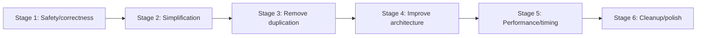

# Incremental Refactoring Roadmap

## Principles and dependency order

Fix observable correctness and ownership first, then simplify duplicated behavior, then improve structure and timing. Keep each change narrow and compile/play-test between stages. Do not introduce an ECS, service locator, dependency-injection framework, or rewrite.

## Stage 1 — Safety / correctness

### R1 — Make compilation and startup deterministic (P0)

- **Problem/location:** Broken guards in `gamemap.h`, `ThreatObject.h`, `PlayHealth.h`; unchecked loads in `main.cpp::LoadFromFile`, `GameMap::LoadMap`, `GameMap::LoadTiles`.
- **Why it matters:** Include-order changes fail compilation; missing/corrupt assets can become null dereferences or invalid tile access.
- **Proposed solution:** Correct guards; make loaders return success/error; validate all required fonts/surfaces/textures/chunks; validate exactly 10,110 map integers and tile IDs before entering menu.
- **Affected modules:** Headers above, `main.cpp`, `gamemap.*`, `BaseObject.*`, HUD/text loaders.
- **Expected benefit:** Predictable startup failure and safer future includes.
- **Risk:** Low to medium; failure paths and cleanup order need testing.
- **Estimated scope:** Medium.

### R2 — Correct projectile and collision semantics (P0)

- **Problem/location:** Uninitialized bullet direction in `BulletObject`; initial facing in `MainObject`; flawed AABB in `CommonFunc.cpp`; incorrect frame widths in player/enemy accessors; chained comparison in `ThreatObject.cpp:258`.
- **Why it matters:** Undefined behavior and false/missed collisions directly affect gameplay.
- **Proposed solution:** Initialize facing/direction; guarantee a direction on every shot; introduce explicit player/enemy/bullet hitbox builders and a tested `SDL_HasIntersection`-equivalent helper; fix enemy tile predicate. First record intended hitbox sizes so replacing 115x95/150x100 does not accidentally change difficulty.
- **Affected modules:** `BulletObject.*`, `MainObject.*`, `ThreatObject.*`, `CommonFunc.*`, `main.cpp` collision calls.
- **Expected benefit:** Deterministic shots and explainable collision behavior.
- **Risk:** High because collision feel can change; use scenario tests/screenshots.
- **Estimated scope:** Medium.

### R3 — Fix SDL/audio ownership order (P0)

**Status:** Completed by refactoring Step 2 on 2026-08-24.

- **Problem/location:** `GameMap` tile textures survive renderer shutdown; no `Mix_CloseAudio`; `BaseObject` can be shallow-copied.
- **Why it matters:** Invalid destruction, leaks, and future double-free risk.
- **Proposed solution:** Add explicit tile cleanup or put renderer after all texture-owning members in a top-level owner; close audio before mixer/SDL quit; delete copy operations and add safe move operations only if needed.
- **Affected modules:** `BaseObject.*`, `gamemap.*`, `main.cpp::close`.
- **Expected benefit:** A single valid lifetime order and safer ownership types.
- **Risk:** Medium to high; borrowed cache references must be cleared before caches.
- **Estimated scope:** Medium.

### R4 — Repair progression and timer rules (P0/P1)

- **Problem/location:** Exact journey equality in `render_journey_img`; inconsistent `start_time` setup/reset in `main.cpp`.
- **Why it matters:** Journey screens do not appear during normal play and elapsed time includes unrelated modal/menu time.
- **Proposed solution:** Detect crossing of each boundary once, keep an explicit journey index, and define whether timer measures Playing time only. Reset/pause according to that written rule.
- **Affected modules:** `main.cpp`, journey globals, restart path; possibly `GameMap` for camera crossing helper.
- **Expected benefit:** Reachable narrative progression and trustworthy completion time.
- **Risk:** Medium; checkpoint/replay behavior must be agreed and regression-tested.
- **Estimated scope:** Small to medium.

**Stage 1 gate:** Build warning baseline understood; startup failure tested with one missing asset; first-shot direction tested; collision scenarios tested; all journey boundaries reachable once; graceful window exit tested under a memory/error tool where available.

## Stage 2 — Simplification

### R5 — Remove strong dead code and stale state (P1/P2)

- **Problem/location:** `ImpTimer`, `LoadMap_Return`, unused fonts/music/state/APIs/constants listed in `10-code-quality-audit.md`.
- **Why it matters:** Dead paths misrepresent the architecture and expand maintenance surface.
- **Proposed solution:** Remove one dead group per commit after call-site search and build. Do not delete unreferenced art indiscriminately.
- **Affected modules:** `Makefile`, `ImpTimer.*`, `gamemap.*`, `main.cpp`, relevant headers.
- **Expected benefit:** Smaller, clearer runtime and build.
- **Risk:** Low; external consumers are not evident but not formally inventoried.
- **Estimated scope:** Small.

### R6 — Establish one authoritative map mutation path (P1)

- **Problem/location:** `getMap`/global copy/`SetMap` round-trip every frame.
- **Why it matters:** Ownership is unclear and work is duplicated.
- **Proposed solution:** Expose a narrow mutable map reference for the current frame or move camera/player-map mutation behind `GameMap`; retain the base map solely for reset.
- **Affected modules:** `gamemap.*`, `main.cpp`, `MainObject.*`, `ThreatObject.*`.
- **Expected benefit:** Clear map authority and removal of ~80 KB copy/frame.
- **Risk:** Medium; references must not outlive `GameMap`, and reset semantics must remain intact.
- **Estimated scope:** Medium.

### R7 — Make bullet ownership explicit (P1)

**Status:** Completed early by refactoring Step 2 because raw ownership was part of that task's acceptance criteria.

- **Problem/location:** Raw owning vector and manual deletion in `MainObject`.
- **Why it matters:** Erase paths are fragile and public setter can duplicate ownership.
- **Proposed solution:** Use `vector<unique_ptr<BulletObject>>`, remove `set_bullet_list`, and use iterator/index-safe erase that does not skip shifted elements.
- **Affected modules:** `MainObject.*`, bullet collision in `main.cpp`.
- **Expected benefit:** Automatic lifetime and simpler removal.
- **Risk:** Medium; main collision loop currently depends on raw pointer/index behavior.
- **Estimated scope:** Small to medium.

## Stage 3 — Remove duplication

### R8 — Share small tile-query primitives (P2)

- **Problem/location:** Player and enemy collision repeat coordinate/range/tile-solid rules.
- **Why it matters:** Equivalent behavior has already diverged into a confirmed bug.
- **Proposed solution:** Add small pure helpers for tile bounds, tile ID classification, and sampled collision cells. Keep player/enemy responses separate.
- **Affected modules:** `CommonFunc.*` or a focused `TileCollision.*`, `MainObject.*`, `ThreatObject.*`, `gamemap.*`.
- **Expected benefit:** One validated definition of blank/heart/solid and bounds.
- **Risk:** High if responses are over-generalized; share queries, not entire entity physics.
- **Estimated scope:** Medium.

### R9 — Data-drive repetitive setup without a framework (P2)

- **Problem/location:** Manual clip assignments and four repeated threat factory loops.
- **Why it matters:** Sprite/enemy changes require editing repeated code.
- **Proposed solution:** Generate clips in loops and describe four enemy groups with a small local configuration array consumed by one factory helper.
- **Affected modules:** `MainObject.cpp`, `ThreatObject.cpp`, `main.cpp::MakeThreats`.
- **Expected benefit:** Less repetition while retaining transparent behavior.
- **Risk:** Medium; preserve exact random-call count/order if deterministic comparison matters.
- **Estimated scope:** Small to medium.

## Stage 4 — Improve architecture

### R10 — Introduce a small top-level owner (P1/P2)

- **Problem/location:** Global resources and state across `main.cpp`/`CommonFunc.cpp`.
- **Why it matters:** Initialization, access, and destruction order are implicit.
- **Proposed solution:** Incrementally create a `Game`/`Application` object whose member declaration order encodes lifetime: SDL context/window/renderer, resources, map/entities/UI, then transient state. Pass only needed references.
- **Affected modules:** Primarily `main.cpp`, then `CommonFunc.*` and constructors/signatures.
- **Expected benefit:** Explicit composition root, safer shutdown, easier testing.
- **Risk:** Large regression surface if done at once; migrate one resource/state cluster per commit.
- **Estimated scope:** Large.

### R11 — Replace modal loops with one state dispatcher (P1)

- **Problem/location:** `Call_Menu`, journey, game-over, and `Win_Game` nested loops; write-only `GameState`.
- **Why it matters:** Input, timing, frame pacing, and exit behavior are duplicated and block Emscripten-style callbacks.
- **Proposed solution:** Keep one event/update/render loop with `switch (state)` and small enter/exit actions. Model four-second/one-second waits as state timers, not nested waits.
- **Affected modules:** `main.cpp`, timing, UI text/resource setup, audio transitions.
- **Expected benefit:** Predictable screen transitions and portable loop structure.
- **Risk:** High; must preserve start/replay sounds, resource lifetime, and state-specific controls.
- **Estimated scope:** Large.

## Stage 5 — Performance and timing

### R12 — Adopt a stable simulation timestep (P1)

- **Problem/location:** Per-frame physics/camera/animation; unused delta.
- **Why it matters:** Gameplay varies with performance.
- **Proposed solution:** Prefer a fixed 60 Hz update accumulator with render decoupling, or consistently scale values with clamped delta. Calibrate against current behavior near 60 Hz and limit catch-up work.
- **Affected modules:** `main.cpp`, `MainObject.*`, `ThreatObject.*`, `BulletObject.*`, animation/respawn logic.
- **Expected benefit:** Stable gameplay speed and testable simulation.
- **Risk:** High; gravity/jump feel and collision tunneling can change.
- **Estimated scope:** Large.

### R13 — Eliminate confirmed idle/static screen churn (P1)

- **Problem/location:** Uncapped menu; immediate text recreation in game-over/win; scratch vector allocation.
- **Why it matters:** Wastes CPU/allocations without improving visuals.
- **Proposed solution:** Cache screen text on state entry/change, pace or event-drive non-playing screens, and retain/reuse collision scratch capacity.
- **Affected modules:** `main.cpp`, `TextObject.*`; state code from R11.
- **Expected benefit:** Lower idle CPU and modal texture churn.
- **Risk:** Low to medium; hover/dynamic score redraw must still work.
- **Estimated scope:** Small after R11, medium before it.

Spatial partitioning and bullet pools are deferred. Current active enemy counts do not justify them without profiler evidence.

## Stage 6 — Cleanup / polish

### R14 — Normalize interfaces, warnings, and repository artifacts (P2/P3)

- **Problem/location:** Misspellings, header cycle, broad includes, stale README commands, tracked objects/binaries, missing `.gitignore`, compiler warnings.
- **Why it matters:** Creates friction and stale deliverables.
- **Proposed solution:** Mechanical renames, split shared headers, direct includes/forward declarations, zero warning budget for app code, one canonical build command, and an owner-approved binary/vendor artifact policy.
- **Affected modules:** Headers/source, Makefile, root docs, Git tracking configuration.
- **Expected benefit:** Faster comprehension/build feedback and reliable distribution artifacts.
- **Risk:** Low for warnings/docs; medium for mass renames and removing tracked artifacts.
- **Estimated scope:** Medium.

## Recommended first modules

Start with `BulletObject`/the firing path, `CommonFunc::CheckCollision`, the three broken headers, journey boundary logic, and `GameMap` texture cleanup. Refactor `main.cpp` state architecture only after those behaviors are covered.

Do not restructure `MainObject::CheckToMap`, `ThreatsObject::CheckToMap`, `Restart`, or global texture caches until collision, checkpoint, and borrowed-resource behavior are explicitly understood and tested.
