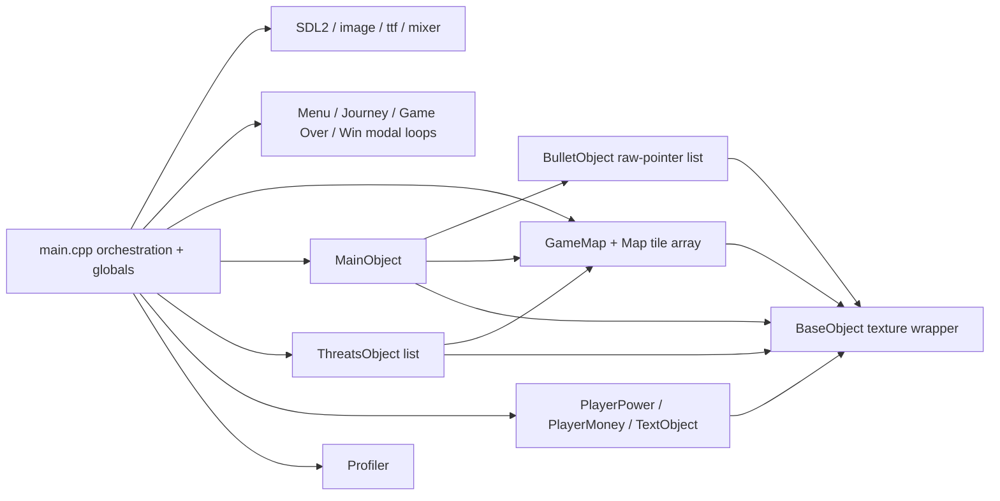

# T-Kun's Journey: Project Knowledge Base

This directory documents the current `main` branch of the SDL2 game as inspected on 2026-08-24. It describes the code that exists now, not the older pre-refactor state recorded in `docs/refact.md`.

## Project at a glance

T-Kun's Journey is a Windows-oriented, single-level, auto-scrolling 2D platform game. The player moves and jumps through a 1011-by-10 tile map, collects hearts, shoots four groups of enemies, and reaches Isha at the end of the map. SDL2 supplies the window, input, and renderer; SDL_image loads images; SDL_ttf renders text; SDL_mixer plays WAV effects/music.

The implementation is a mixed procedural/object-oriented design. Domain objects exist for the player, enemies, bullets, map, HUD icons, text, and profiling, but `src/main.cpp` owns most resources and orchestrates every screen and gameplay system through global state.

## Current status

- The current sources build successfully with the flags in `Makefile` using MSYS2 `g++ 14.1.0`.
- The build emits warnings, including warnings on two suspicious boolean expressions.
- No project test suite is present.
- Step 1 captured a settled-menu CPU sample and one automated gameplay-to-game-over stress run; measured window-close shutdown returned exit code 0. Full-level behavior, replay/win, long-run leaks, and low-end-hardware performance remain **not confirmed from the current codebase**. See the [performance baseline](../performance-baseline.md).
- Refactor commits 1-10 added profiling, safer enemy ownership, texture caching, active-range filtering, culling, text caching, map reset caching, and removal of the runtime `windows.h` dependency. Important correctness and lifecycle debt remains.

## High-level architecture

## Documentation navigation

1. [Project overview](01-project-overview.md)
2. [Repository structure](02-repository-structure.md)
3. [Build and run](03-build-and-run.md)
4. [Architecture](04-architecture.md)
5. [Runtime flow](05-runtime-flow.md)
6. [Game loop](06-game-loop.md)
7. [Systems and modules](07-systems-and-modules.md)
8. [Data and state flow](08-data-and-state-flow.md)
9. [Resource management](09-resource-management.md)
10. [Code-quality audit](10-code-quality-audit.md)
11. [Performance audit](11-performance-audit.md)
12. [Technical-debt inventory](12-technical-debt.md)
13. [Incremental refactoring roadmap](13-refactoring-roadmap.md)
14. [File reference](14-file-reference.md)
15. [AI maintenance guide](15-ai-maintenance-guide.md)

## Recommended reading order

For a feature or bug fix, read this index, `04-architecture.md`, `05-runtime-flow.md`, and the relevant entry in `07-systems-and-modules.md`. Before changing ownership, collision, map progression, or timing, also read `09-resource-management.md`, `10-code-quality-audit.md`, and `15-ai-maintenance-guide.md`. Use `13-refactoring-roadmap.md` only after the correctness items in `12-technical-debt.md` have been reviewed.
